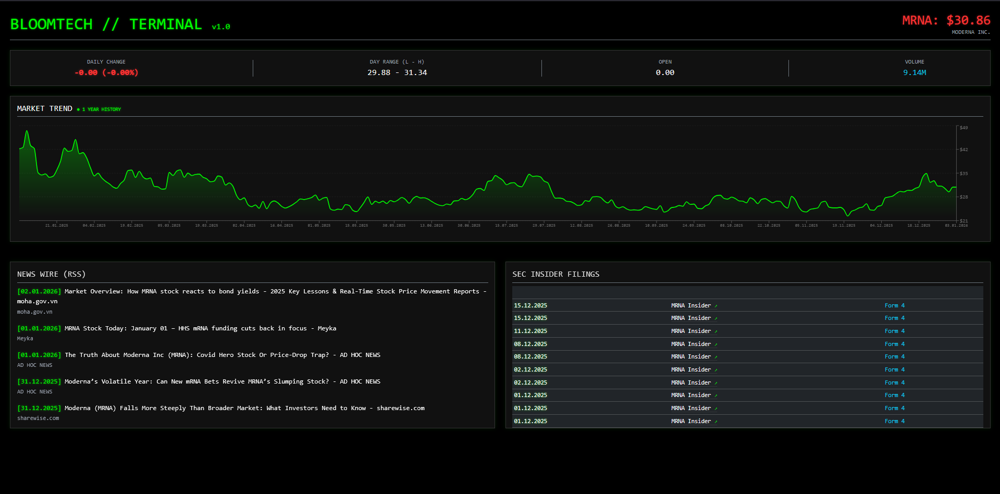

# BloomTech Tracker

**BloomTech Tracker** is an enterprise-grade financial analytics dashboard designed to streamline market monitoring processes. By leveraging a microservices-inspired architecture, it aggregates disparate data sources—including live stock metrics, regulatory filings (SEC), and global news feeds—into a centralized, real-time interface.

### Design Philosophy: Data-Centric Ergonomics
The user interface is built upon a **High-Contrast Dark Mode** paradigm. This design choice is not merely aesthetic but functional; it is specifically engineered to:
* **Maximize Readability:** High-visibility indicators (Green/Red) against a dark background allow for instant recognition of market trends.
* **Reduce Visual Fatigue:** Optimized for financial professionals who require long operational hours, minimizing eye strain associated with bright screens.
* **Enhance Focus:** A minimalist, distraction-free layout ensures that the data remains the primary focus.

## Dashboard Overview

---

## Key Capabilities

* **Real-Time Market Telemetry:** Instantaneous tracking of price action, volume, and daily volatility via Yahoo Finance integration.
* **Historical Data Visualization:** Interactive area charts powered by Recharts, rendering large datasets (1-year history) with high performance.
* **Automated News Aggregation:** Real-time ingestion of corporate news via RSS feeds, filtering for relevant market intelligence.
* **Regulatory Compliance Tracking:** Direct monitoring of SEC "Form 4" filings to detect insider trading activities by corporate executives.
* **Resilient Background Processing:** Utilizes **Hangfire** for reliable, non-blocking data synchronization and scheduled task execution.
* **Bulk Data Seeding:** Includes dedicated controllers for rapidly populating the database with historical datasets for backtesting and analysis.

## Technical Architecture

This project is constructed using **Clean Architecture** principles, ensuring separation of concerns, scalability, and testability.

### Backend (.NET 8)
* **ASP.NET Core Web API:** RESTful API design with strict typing.
* **Entity Framework Core (SQLite):** Efficient data persistence and ORM handling.
* **Hangfire:** Distributed background job processing for data fetching pipelines.
* **Dependency Injection:** Loosely coupled architecture for modular maintenance.

### Frontend (React + Vite)
* **React 18:** Component-driven UI development.
* **Recharts:** High-performance charting library for financial data.
* **Bootstrap 5:** Responsive grid layout for cross-device compatibility.
* **Axios:** Optimized HTTP client for API communication.